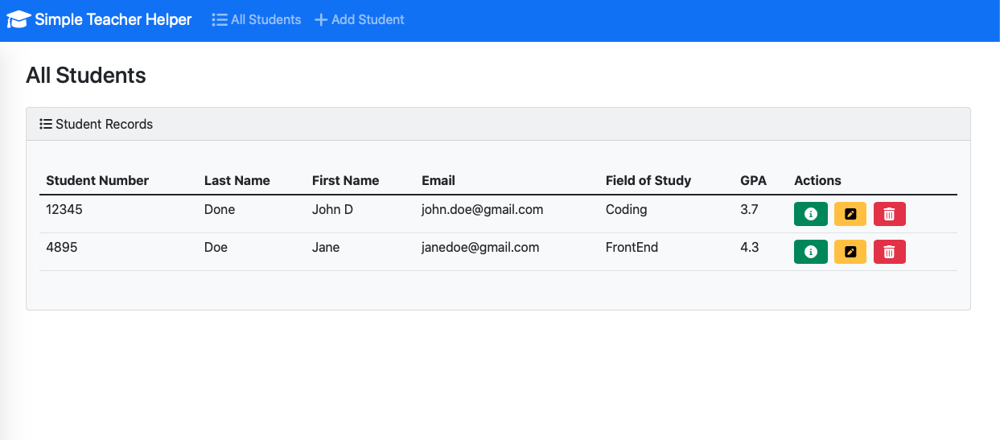
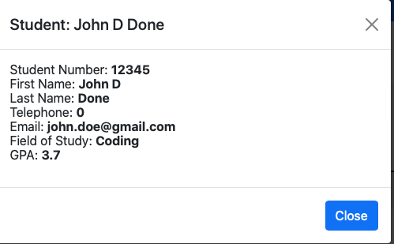
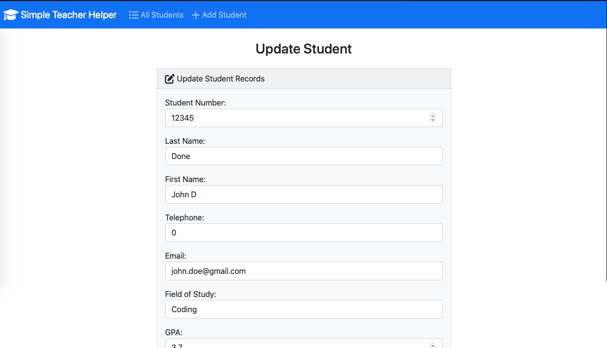
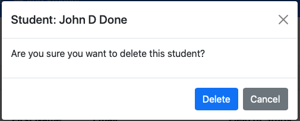

# simple_teacher_helper_bootstrap-debug
Simple CRUD app with CBV built using Django and Bootstrap meant to help with debugging practice. Project idea dased on Student management project which used Function based views, views and models have been updated to class-based views.  HTML and CSS have also been updated.

## Prerequisites

Install the following prerequisites:

1. [Python 3.10.4 or higher](https://www.python.org/downloads/)
2. [Visual Studio Code](https://code.visualstudio.com/download)

## Installation

### 1. Create a virtual environment

From the **root** directory run:

```bash
python -m venv venv
```

### 2. Activate the virtual environment

From the **root** directory run:

On macOS:

```bash
source venv/bin/activate
```

On Windows:

```bash
venv\scripts\activate
```

### 3. Install required dependencies

From the **root** directory run:

```bash
pip install -r requirements.txt
```

### 4. Run migrations

From the **root** directory run:

```bash
python manage.py makemigrations
```
```bash
python manage.py migrate
```

### 5. Run installations for boostrap and libraries

```bash
pip3 install importlib-metadata
pip install django-bootstrap-v5
pip install django-bootstrap
```

## Run the application

From the **root** directory run:

```bash
python manage.py runserver
```

## View the application

Go to http://127.0.0.1:8000/ to view the application.

## Main Page

## Studet Details Pop Up window

## Update Page

## Delete Pop Up Window

